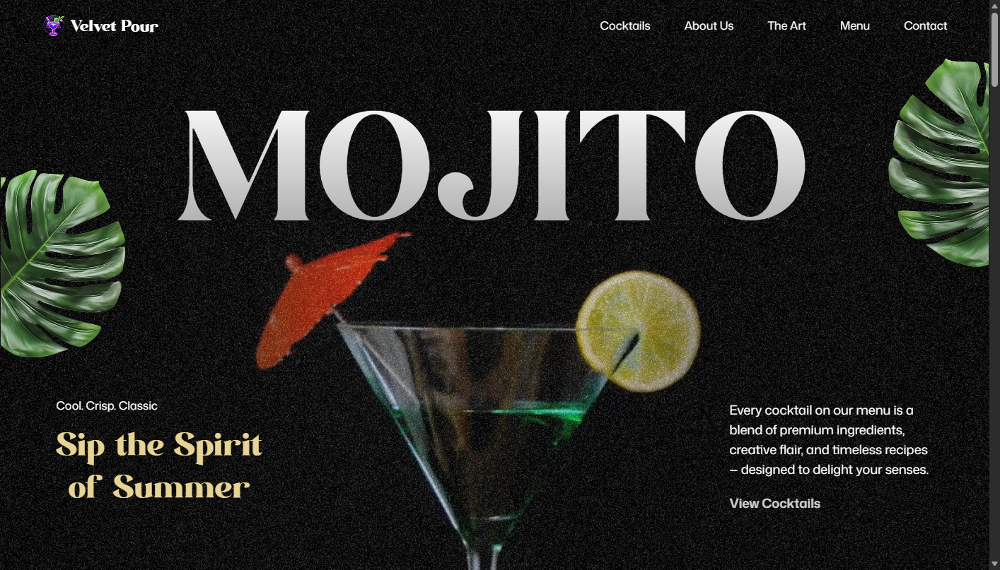
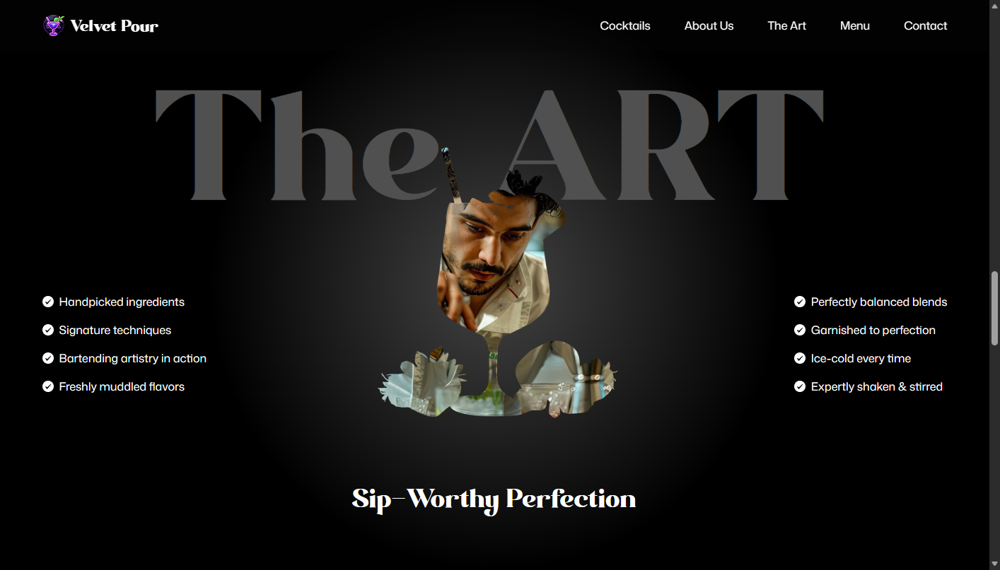

# 🍸 Velvet Pour — Artisanal Cocktail Experience

<div align="center">

  [](https://cocktails-gsap-psi.vercel.app/#contact)
  [](https://react.dev/)
  [](https://vitejs.dev/)
  [](https://greensock.com/gsap/)
  [](https://tailwindcss.com/)

  <p align="center">
    <strong>A visually immersive, luxury landing page for an upscale cocktail bar crafted with React 19, Tailwind CSS v4, and cutting-edge GSAP scroll-driven animations.</strong>
  </p>

  <p align="center">
    <a href="https://cocktails-gsap-psi.vercel.app/#contact"><strong>Explore the Live Experience »</strong></a>
  </p>
</div>

---

## 🌟 Overview

**Velvet Pour** is an ultra-modern landing page engineered to celebrate the artistry of mixology. Designed with a dark luxury aesthetic, rich textures, and high-performance scroll choreography, the site delivers a cinematic storytelling journey — from floating ambient botanical elements to an interactive drink recipe slider and a scroll-triggered masked image expansion.

---

## 🚀 Live Demo

Experience the live application deployed on Vercel:  
🔗 **[https://cocktails-gsap-psi.vercel.app/#contact](https://cocktails-gsap-psi.vercel.app/#contact)**

---

## 📸 Visual Showcase

<div align="center">
  <h3>✨ Ambient Floating Hero Experience</h3>
  

  <br/><br/>

  <h3>🎭 "The Art" — Pinned Mask Silhouette Reveal</h3>
  
</div>

---

## 🛠️ Tech Stack & Tools

| Technology | Logo | Description |
| :--- | :---: | :--- |
| **React 19** |  | Modern UI library utilizing functional components and hooks |
| **GSAP 3** |  | Industry-standard animation suite (`gsap`, `@gsap/react`, `ScrollTrigger`, `SplitText`) |
| **Tailwind CSS v4** |  | Next-gen utility-first styling with theme variables & custom utilities |
| **Vite 8** |  | Blazing-fast frontend tooling and Hot Module Replacement (HMR) |
| **React Responsive** |  | Media query hooks for responsive animation trigger coordinates |
| **Vercel** |  | Cloud platform for serverless production hosting |

---

## ✨ Key Features & Sections

- **🌿 Ambient Floating Hero**: Seamless video background blended with floating botanicals and bold typographic hierarchy.
- **🍸 Curated Cocktail List**: Classic and house signatures detailed with pricing, ingredients, and taste profiles.
- **📖 About & Craftsmanship Story**: Split-text word animations, key metrics (+12,000 satisfied guests, 4.5/5 rating), and dynamic photography grid with subtle noise textures.
- **🎭 "The Art" — Pinned Mask Reveal**:
  - The centerpiece interactive section.
  - The cocktail glass silhouette functions as a CSS image mask revealing a craftsman pouring a signature drink.
  - As the user scrolls, the section pins seamlessly: surrounding content fades out, the image scales up by 1.3x, and the mask expands from `50%` to `400%` before disappearing into the full visual while the craft statement fades in.
- **🍹 Interactive Recipe Carousel**: Custom carousel slider with animated glass transitions (`fromTo` slide-in and text reveals), allowing users to explore tasting notes, ingredients, and garnish details for every drink.
- **📍 Contact & Operating Details**: Elegant footer complete with opening hours, social links, and reservations call-to-action.

---

## 💡 What I Learned Using GSAP for the First Time

This project was my first deep dive into **GSAP (GreenSock Animation Platform)** in a modern React application. Building complex scroll animations provided invaluable hands-on lessons:

### 1. Declarative Animations in React with `useGSAP`
- Traditional `useEffect` hooks often suffer from cleanup complexities and animation leaks when React re-renders or mounts in Strict Mode.
- Using the official `@gsap/react` `useGSAP` hook automatically handles animation lifecycle management, scoped selectors, and memory cleanup.

### 2. Timeline Orchestration & ScrollTrigger Scrubbing
- Instead of coordinating isolated tweens, chaining multiple animations into a single `gsap.timeline({ scrollTrigger: { scrub: 1.5, pin: true } })` allowed precise sequencing:
  1. Fading out surrounding text with staggered timings (`stagger: 0.2`).
  2. Scaling the visual and expanding the mask simultaneously.
  3. Fading in the final narrative once the visual fills the canvas.

### 3. CSS Masking with GSAP & Unit Normalization
- Animating CSS `mask-size` revealed subtle browser mechanics: Chromium/WebKit resolves a single-value `mask-size: 50%` as `"50% auto"` in computed styles.
- When animating to `"400%"`, GSAP encountered a unit mismatch between `"% auto"` and `"%"`, which caused its unit conversion fallback to evaluate to `0%` (rendering the mask invisible).
- **The Solution**: Maintaining consistent multi-value units (`mask-size: 50% auto` transitioning to `maskSize: "400% auto"` along with `-webkit-` vendor prefixes) ensured smooth interpolation across all browsers.

### 4. Avoiding Modern CSS `translate` vs GSAP `transform` Clashes
- In Tailwind CSS v4, utility classes like `-translate-x-1/2 -translate-y-1/2` utilize the modern standalone CSS `translate` property (`translate: -50% -50%`).
- When GSAP animates `scale`, its CSS plugin evaluates the element's computed transform matrix. If both standalone `translate` and GSAP's `transform` are applied, it results in a double-translation offset.
- **Takeaway**: Keeping parent containers responsible for positioning and letting GSAP own the child element's transforms guarantees pixel-perfect layout stability.

### 5. Kinetic Typography with SplitText
- Utilizing `SplitText` to break headlines into individual words and staggering their entrance (`yPercent: 100`, `opacity: 0` to `opacity: 1`) creates a luxurious editorial feel that static typography simply cannot match.

---

## 📁 Project Structure

```text
mojito-landing-page/
├── constants/
│   └── index.js              # Cocktail listings, features, recipes, and slide data
├── public/
│   ├── fonts/                # Custom typography (Modern Negra, etc.)
│   └── images/               # High-res cocktail renders, textures, and mask silhouettes
├── screenshots/              # High-res UI preview captures for documentation
├── src/
│   ├── components/
│   │   ├── About.jsx         # SplitText story & photo grid
│   │   ├── Art.jsx           # Pinned scroll-scrubbed mask animation
│   │   ├── Cocktails.jsx     # Signature drinks showcase
│   │   ├── Contact.jsx       # Footer, operating hours, & contact details
│   │   ├── Hero.jsx          # Video background & hero typography
│   │   ├── Menu.jsx          # Interactive recipe carousel slider
│   │   └── Navbar.jsx        # Fixed glassmorphic navigation bar
│   ├── App.jsx               # Main application container & plugin registration
│   ├── index.css             # Tailwind v4 configuration, font imports, & utilities
│   └── main.jsx              # React DOM root entry point
├── .gitignore                # Comprehensive ignore rules
├── package.json              # Project dependencies & scripts
└── vite.config.js            # Vite build configuration with Tailwind integration
```

---

## 💻 Getting Started Locally

### Prerequisites
- **Node.js** (v18.0.0 or higher recommended)
- **npm**, **yarn**, or **pnpm**

### Installation

1. **Clone the repository:**
   ```bash
   git clone https://github.com/your-username/mojito-landing-page.git
   cd mojito-landing-page
   ```

2. **Install dependencies:**
   ```bash
   npm install
   ```

3. **Start the local development server:**
   ```bash
   npm run dev
   ```

4. **Open in your browser:**  
   Navigate to `http://localhost:5173` to see the site running locally.

### Production Build

To generate an optimized production bundle:
```bash
npm run build
```

To preview the production build locally:
```bash
npm run preview
```

---

## 📄 License

This project is created for educational and portfolio demonstration purposes.

---

<div align="center">
  Crafted with passion, ice-cold precision, and smooth animations 🍸
</div>
